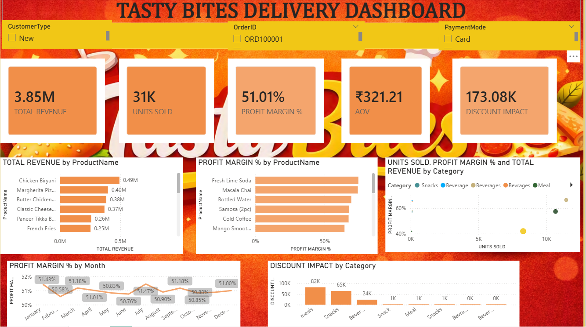

# Tasty Bites Food Delivery Analysis

## Project Overview

This project analyzes food delivery data using Microsoft Power BI to understand sales performance, customer orders, revenue trends, and business performance.

## Tools Used

- Power BI
- Power Query
- DAX
- Data Visualization

## Dashboard Highlights

- Total revenue and order analysis
- Customer and order performance
- Sales trends
- Food category analysis
- Delivery and order insights
- Interactive Power BI dashboard

## Project Objective

The objective of this project is to analyze food delivery data and identify meaningful business insights that can help understand sales performance, customer behavior, and overall business growth.

## Files Included

- Power BI .pbix file
- Project presentation .pptx
- Dashboard screenshot

## Dashboard Preview

